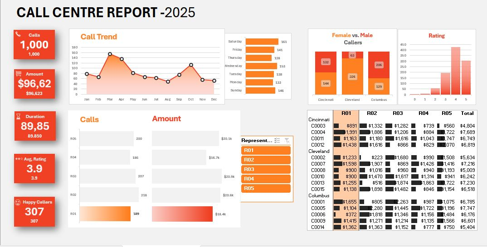

# 📞 Call Centre Report Dashboard - 2025

## 📝 Project Overview
This Excel dashboard provides a detailed performance report for a call centre, focusing on five representatives. It includes metrics like total calls, revenue generated, call duration, average ratings, and gender breakdown. The goal is to track performance, analyze trends, and identify key contributors across different cities.

## 💡 Key Insights
- One representative handled the highest number of calls.
- The highest revenue was generated from calls in a specific location.
- Call volume showed seasonal peaks during certain months.
- The majority of top-rated calls came from a particular representative.

## 🛠 Tools & Techniques Used
- Microsoft Excel
- Pivot Tables & Charts
- Slicers for filtering by representative
- Conditional Formatting
- Data Cleaning & Formatting

## 📷 Dashboard Preview

## 📁 Files Included
- `Call_Centre_Report_2025.xlsx` – Interactive dashboard and Sample dataset
- `README.md` – Project documentation

## 📌 How to Use
1. Open `Call_Centre_Report_2025.xlsx` in Microsoft Excel.
2. Use the slicers to filter performance by representative (R01–R05).
3. Explore visualizations to analyze call volume, duration, revenue, and gender-based insights.
4. For previewing the dashboard, review this video: [Youtube Video](https://youtu.be/mLZ6XvsrvS4).

## 📬 Contact
Feel free to connect with me on [LinkedIn](https://www.linkedin.com/in/maheen-khalid-38a0591b0/).
